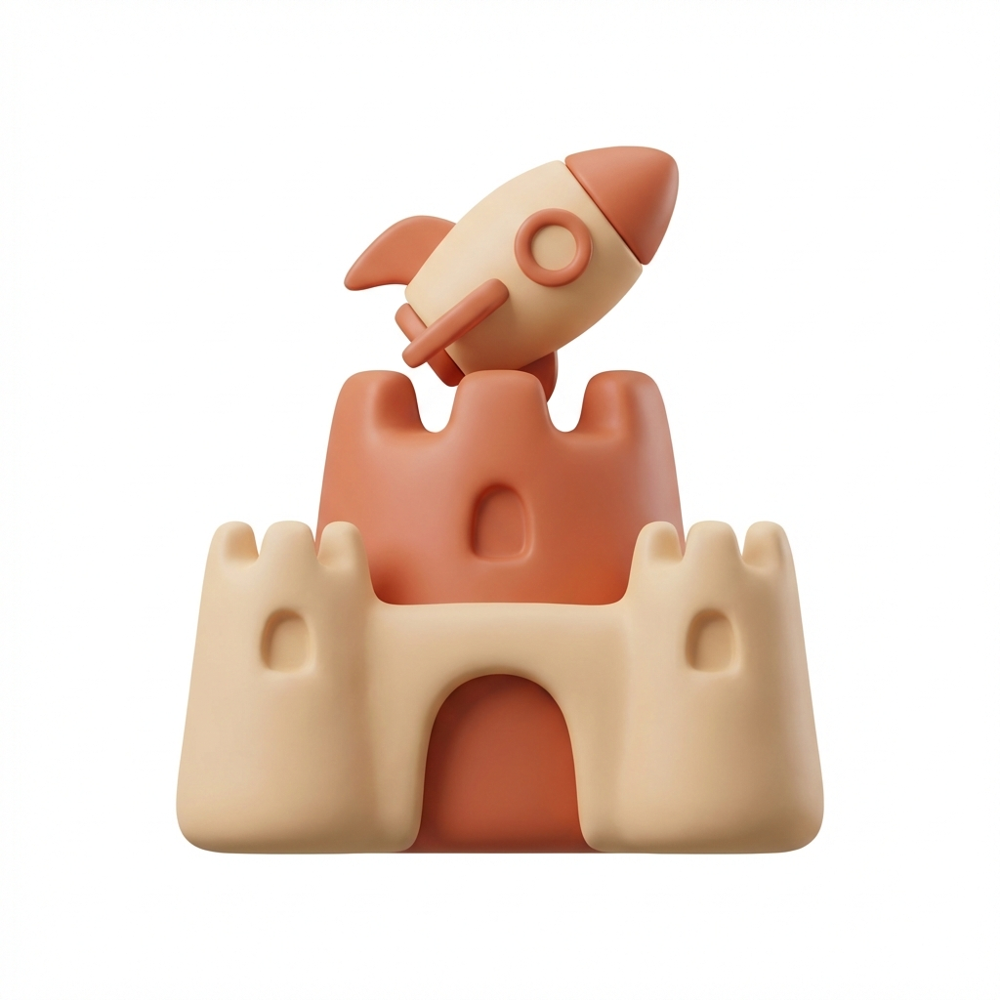

<div align="center">
  
  <h1>Super Sandbox</h1>
  <p>
    <strong>A starter kit for agentic coding with Claude Code.</strong><br>
    Battle-tested workflows, skills, and tools to supercharge your AI coding sessions.
  </p>
</div>

---

## Quick Start

**Point your AI agent at the setup guide:**

```
Read SETUP.md and help me set up Super Sandbox
```

Or if you haven't cloned yet:

```bash
git clone https://github.com/marofyi/super-sandbox.git
cd super-sandbox
claude "Read SETUP.md and help me set up Super Sandbox"
```

The agent will guide you through installing skills, MCP servers, and tools.

---

## What's Included

### Skills

Install the official [Anthropic skills](https://github.com/anthropics/skills) via the plugin system:

```
/plugin marketplace add anthropics/skills
/plugin install document-skills@anthropic-agent-skills
/plugin install example-skills@anthropic-agent-skills
```

This gives you `xlsx`, `pdf`, `pptx`, `docx`, `doc-coauthoring`, `frontend-design`, and more.

**Custom skills included in this repo:**

| Skill | Purpose |
|-------|---------|
| `vercel` | Deployment automation |

### MCP Servers

| Server | Capabilities |
|--------|--------------|
| [Nanobanana](mcp/nanobanana.md) | Image generation, editing, diagrams (7 tools) |
| [Context7](mcp/context7.md) | Documentation lookup for any library |
| [Chrome DevTools](mcp/chrome-devtools.md) | Browser automation for SSH/headless |

### Tools

| Tool | Purpose |
|------|---------|
| [Statusline](statusline/) | Terminal status with branch and context usage |
| [Claude-in-Chrome](browser/claude-in-chrome.md) | Browser automation extension |

### Sandbox (Optional)

Run Claude Code in an isolated environment:
- [OrbStack Setup](sandbox/orbstack-setup.md) - macOS VM
- [Shell Aliases](sandbox/aliases.md) - Useful shortcuts

---

## Documentation

| Document | Purpose |
|----------|---------|
| [SETUP.md](SETUP.md) | **Start here** - Agent-guided installation |
| [AGENTS.md](AGENTS.md) | Agent behavior guidelines |
| [CONTRIBUTING.md](CONTRIBUTING.md) | Contribution guidelines |
| [mcp/](mcp/) | MCP server setup guides |
| [browser/](browser/) | Browser automation setup |
| [sandbox/](sandbox/) | Isolated environment setup |

---

## Requirements

- Claude Code CLI v2.0.73+
- Direct Anthropic plan (Pro/Max/Team/Enterprise)
- macOS, Linux, or Windows
- Node.js 18+ (for MCP servers)

---

## Philosophy

Super Sandbox is built on these principles:

1. **Research first** - Don't trust training data alone
2. **Plan before build** - Propose, get approval, then implement
3. **Test your work** - Verify manually at minimum
4. **Ask when uncertain** - Stop and clarify

See [AGENTS.md](AGENTS.md) for detailed workflow guidelines.

---

## Project Structure

```
super-sandbox/
├── SETUP.md              # Agent-guided installation
├── AGENTS.md             # Agent behavior rules
├── skills/               # Custom skills
│   └── vercel/           # Deployment automation
├── mcp/                  # MCP server guides
├── browser/              # Browser automation guides
├── sandbox/              # Isolated environment guides
└── statusline/           # Custom terminal status
```

---

<div align="center">
  <p>MIT License</p>
</div>
